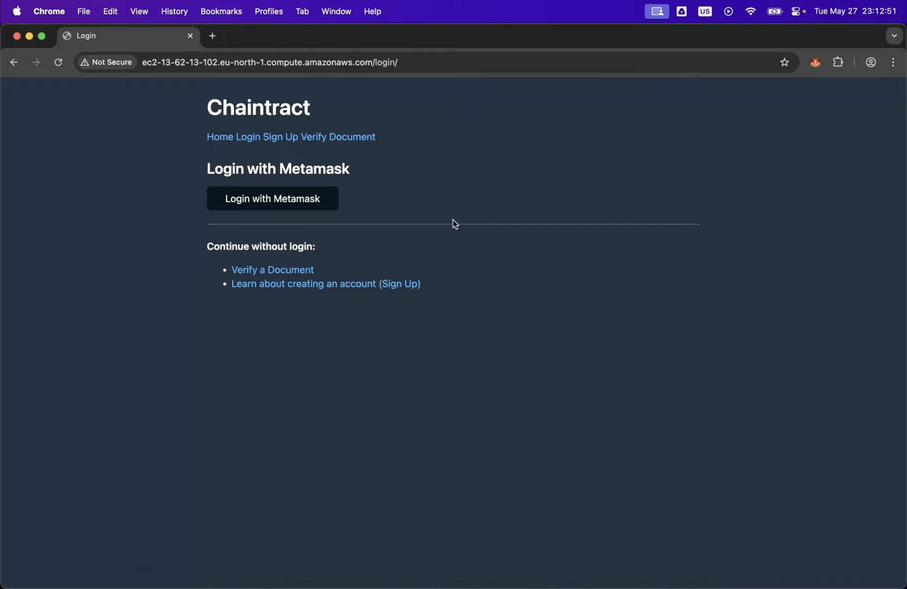

# ChainTract

**ChainTract** is a blockchain-based e-contract platform designed to simplify and secure the signing process between parties. By combining Django, Ethereum smart contracts, and decentralized file hashing, ChainTract ensures transparency, authenticity, and immutability of agreements.

## 🎥 Project Showcase

Check out the project in action in this demo video:

[Watch on YouTube](https://youtu.be/RpeDq46ouBk)

## 🔐 Key Features

- **Decentralized Signature Verification**: Leveraging Ethereum smart contracts for trustless validation.
- **File Integrity Guarantee**: Hashes of signed documents are stored on-chain for tamper detection.
- **MetaMask Integration**: Enables users to sign in and authorize signatures with their Ethereum wallets.
- **Simple Frontend**: Lightweight HTML and JavaScript interface to keep interactions intuitive.
- **MongoDB Backend**: Scalable and flexible data management for user and file metadata.
- **AWS Deployment**: Secure and scalable cloud infrastructure using EC2, S3, and more.

## 📁 Technologies Used

- **Backend**: Python (Django)
- **Smart Contracts**: Solidity (Ethereum Sepolia Testnet)
- **Frontend**: HTML, JavaScript (No frameworks)
- **Database**: MongoDB
- **Cloud Services**: AWS (S3, EC2, Nginx, Gunicorn)
- **Authentication**: MetaMask Wallet

## 📌 Status

✅ Initial release with working demo, MetaMask login, signature validation, and AWS-hosted services.
